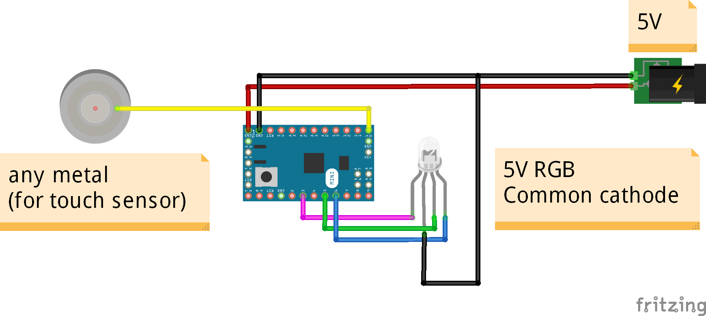

# Arduino-capacitive-touch-RGB
Library Arduino for capacitive touch and RGB led
- Detect touch and hold
- Control RGB
	- Color
	- Brightness
	- etc
	
## Demo
[](https://youtu.be/1S4xeuDZLzs)

## Instalation guide
Just download and upload it to arduino board using arduino IDE
> NOTE:  
> - Sensitivity may vary depending on touch area and pressure.
> - Capacitive pin may be sensitive to current, use a good power supply or battery.
> - In some cases, requires touching body / ground to detect capacitive touch.
> - If you found a better library for capacitive please let me know... ^___^ thx b4
## Components
- Arduino board
- RGB Led strip / RGB led (common anode / cathode)
- N channel FET (optional)
- Power supply

## Wiring
- RGB common anode

- RGB common cathode

- Using N channel mosfet

	> If using N channel FET, you need to set it to common cathode.  
	> CODE : `#define COMMON_ANODE false`
	
## Touch Mapping
```
start
|
+-- any touch ==> turn on
|
+-- 2x touch ==> change mode (mode 1 to 10) ==> list mode in ronnRGB.h
|
+-- 3x touch ==> turn off
|
+-- 4x touch ==> setting mode (3x blink blue)
|   |
|   +-- 1x touch ==> change color
|   |
|   +-- 1x touch + hold ==> step change color
|   |
|   +-- 2x touch ==> increase brightness +50 (blink red when max)
|   |
|   +-- 2x touch + hold ==> increase brightness (blink red when max)
|   |
|   +-- 3x touch ==> decrease brightness -50 (blink red when minimum)
|   |
|   +-- 3x touch + hold ==> decrease brightness (blink red when mininmum)
|   |
|   +-- 4x touch ==> exit setting mode (3x blink green)
|
+-- 10x touch ==> reset default (blink yellow)
```

## License and credits
My code under MIT license, other libraries follow their own license.
- Timer.h
- capacitive.h
- etc...

## Donation  
Support me  
- [Send me coffee](https://sociabuzz.com/fahroniganteng/tribe)
- [or maybe ice cream](https://trakteer.id/fahroniganteng/tip) 
